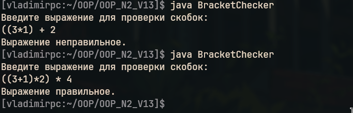

Создать запрос для вывода только правильно написанных выражений со скобками (количество открытых и закрытых скобок должно быть одинаково).
– пример правильных выражений: (3 + 5) – 9 × 4.
– пример неправильных выражений: ((3 + 5) – 9 × 4.

